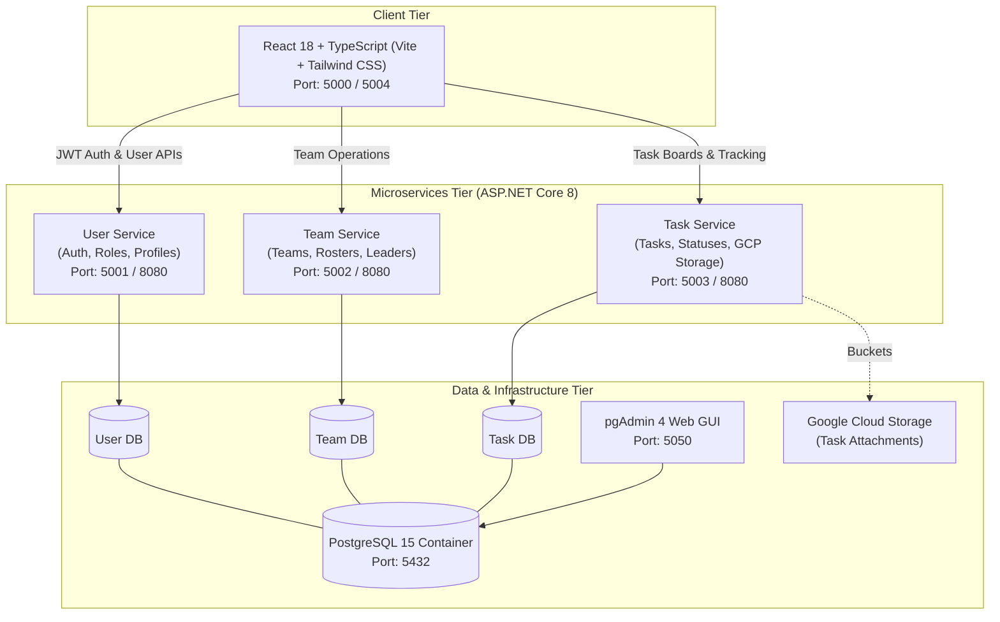

# Project Management System (PMS) — Microservices Architecture

[](https://dotnet.microsoft.com/)
[](https://react.dev/)
[](https://www.typescriptlang.org/)
[](https://www.docker.com/)
[](https://www.postgresql.org/)
[](https://cloud.google.com/)
[](https://tailwindcss.com/)
[](https://swagger.io/)

A scalable, enterprise-grade **Project Management System (PMS)** inspired by Jira and Linear, engineered from the ground up using a **microservices architecture**. Built with ASP.NET Core Web APIs, React 18, TypeScript, PostgreSQL, and fully orchestrated via Docker Compose for both local development and cloud deployment on Google Cloud Platform (GCP).

---

## Architecture Overview

The system strictly adheres to the **Database-per-Service** pattern, decoupling domains across authentication, team management, and project execution. Services communicate over asynchronous-ready RESTful interfaces, and database migrations are managed independently per service via Entity Framework Core.



---

## Key Features

### 1. User & Identity Service
- **Authentication & Security:** JWT (JSON Web Tokens) Bearer token generation with BCrypt password hashing.
- **Role-Based Access Control (RBAC):** Tiered permission levels (`Admin`, `TeamLeader`, `Member`).
- **User Activation Lifecycle:** Self-service registration with automated pending status, requiring administrator verification and approval before system activation.
- **Dual Login Support:** Seamless login via either verified email address or username.

### 2. Team Management Service
- **Collaborative Teams:** Create cross-functional teams, designate team leaders, and assign members.
- **Roster Controls:** Dynamically reassign personnel across squads and track active memberships.
- **Domain Decoupling:** Communicates identity references through decoupled user identifiers.

### 3. Task & Project Execution Service
- **Full Lifecycle Task Management:** Create, prioritize (Low, Medium, High, Critical), track, and update task stages (To-Do, In Progress, In Review, Done).
- **Assignee Routing:** Direct task assignment to team members with deadline monitoring.
- **Cloud Attachment Storage:** Native integration with Google Cloud Storage (GCS) buckets for task file attachments and documentation.

### 4. Modern Single Page Application (SPA)
- **Frontend Stack:** React 18, TypeScript, Vite, Tailwind CSS, React Router DOM, and React Toastify.
- **Dynamic Role-Based UI:** Context-aware navigation menu, dashboard widgets, and actions tailored specifically to the authenticated user's role.
- **Responsive Layout:** Clean, accessible, mobile-first design built with Tailwind CSS.

---

## Live Deployment & Access

The application is deployed on a dedicated **Google Cloud Platform (GCP Compute Engine VM)** instance:

| Component | Target URL | Description |
| :--- | :--- | :--- |
| **Frontend Application** | [http://34.6.169.37:5000/](http://34.6.169.37:5000/) | Production React SPA UI |
| **User Service Swagger** | [http://34.6.169.37:5001/swagger](http://34.6.169.37:5001/swagger/index.html) | OpenAPI documentation for User Service |
| **Team Service Swagger** | [http://34.6.169.37:5002/swagger](http://34.6.169.37:5002/swagger/index.html) | OpenAPI documentation for Team Service |
| **Task Service Swagger** | [http://34.6.169.37:5003/swagger](http://34.6.169.37:5003/swagger/index.html) | OpenAPI documentation for Task Service |
| **pgAdmin Dashboard** | [http://34.6.169.37:5050/](http://34.6.169.37:5050/browser/) | PostgreSQL database management UI |

### Demo Credentials

| Role | Username / Identifier | Password | Access Capabilities |
| :--- | :--- | :--- | :--- |
| **Administrator** | `admin` | `admin` | Full system access, activate new users, oversee all teams & tasks |
| **Team Leader** | `user_1` | `admin` | Create squads, assign members, manage task boards |
| **Member** | `user_2` | `admin` | View assigned tasks, update execution status, collaborate |

---

## Technology Stack

### Backend & Microservices
- **Language & Runtime:** C# / .NET 8.0 SDK
- **Framework:** ASP.NET Core Web API
- **ORM & Data Access:** Entity Framework Core (Code-First with automatic migration execution)
- **Authentication:** JWT Bearer Authentication, BCrypt.Net-Next
- **API Standards:** RESTful architecture, OpenAPI / Swagger UI

### Frontend
- **Framework & Tooling:** React 18, TypeScript, Vite
- **Styling:** Tailwind CSS, PostCSS, Autoprefixer
- **Networking:** Axios with request/response interceptors for JWT injection
- **Routing & Feedback:** React Router v6, React Toastify

### Infrastructure & DevOps
- **Containerization:** Docker multi-stage builds (`Dockerfile` per service)
- **Orchestration:** Docker Compose with health checks and network isolation
- **Database Engine:** PostgreSQL 15 Alpine (independent databases: `pms_users`, `pms_teams`, `pms_tasks`)
- **Database Tooling:** pgAdmin 4
- **Cloud Provider:** Google Cloud Platform (Compute Engine VM, GCS Buckets)

---

## Getting Started (Local Development)

### Prerequisites
- [Docker Desktop](https://www.docker.com/products/docker-desktop/) (with Docker Compose v2+)
- [Git](https://git-scm.com/)

### 1. Clone the Repository
```bash
git clone https://github.com/dstathoulias/pms-app.git
cd pms-app
```

### 2. Configure Environment Variables
Create a `.env` file in the root directory (or configure the provided variables):
```env
POSTGRES_USER=postgres
POSTGRES_PASSWORD=password123
POSTGRES_DB=pms_master
POSTGRES_PORT=5432
POSTGRES_HOST=postgres

USERS_DB=pms_users
TEAMS_DB=pms_teams
TASKS_DB=pms_tasks

PORT_USER_SERVICE=5001
PORT_TEAM_SERVICE=5002
PORT_TASK_SERVICE=5003
PORT_FRONTEND=5000
PORT_PGADMIN=5050

PGADMIN_DEFAULT_EMAIL=admin@pms.com
PGADMIN_DEFAULT_PASSWORD=admin

VITE_USER_API_URL=http://localhost:5001
VITE_TEAM_API_URL=http://localhost:5002
VITE_TASK_API_URL=http://localhost:5003
```

### 3. Build & Run via Docker Compose
```bash
docker compose up --build
```

The database container will run initial health checks, after which each microservice automatically applies Entity Framework migrations and seeds default test roles and data.

### 4. Access Local Services
- **Web UI:** `http://localhost:5000`
- **User API Swagger:** `http://localhost:5001/swagger`
- **Team API Swagger:** `http://localhost:5002/swagger`
- **Task API Swagger:** `http://localhost:5003/swagger`
- **pgAdmin:** `http://localhost:5050` (Email: `admin@pms.com`, Password: `admin`)

---

## Repository Structure

```text
pms-app/
├── docker-compose.yml          # Multi-container orchestration definition
├── pms_microservices.sln       # Visual Studio / .NET Solution
├── user_service/               # User Authentication & RBAC Service (ASP.NET Core)
│   ├── Controllers/
│   ├── Data/                   # EF Core DbContext & Migrations
│   ├── Models/
│   └── Dockerfile
├── team_service/               # Team & Squad Organization Service (ASP.NET Core)
│   ├── Controllers/
│   ├── Data/
│   ├── Models/
│   └── Dockerfile
├── task_service/               # Task & Project Lifecycle Service (ASP.NET Core)
│   ├── Controllers/
│   ├── Data/
│   ├── Models/
│   └── Dockerfile
└── frontend/                   # Client Web Application (React + TypeScript)
    ├── src/
    │   ├── components/         # Reusable UI components
    │   ├── pages/              # Role dashboards & auth views
    │   ├── services/           # Axios API clients
    │   └── App.tsx
    ├── package.json
    ├── vite.config.ts
    └── Dockerfile
```

---

## Author & Contact

**Dimitris Stathoulias**  
- **GitHub:** [@dstathoulias](https://github.com/dstathoulias)  
- **Email:** [stath.jim2000@gmail.com](mailto:stath.jim2000@gmail.com)
